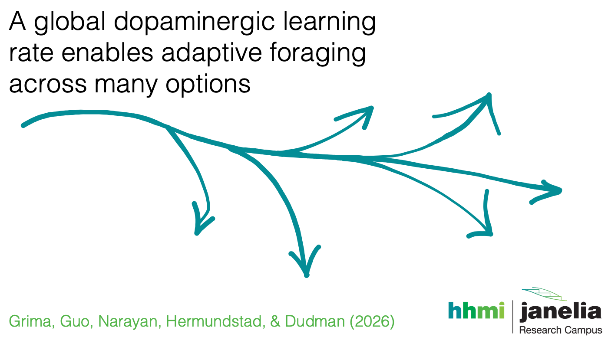

  

This repository contains analysis code, task code, and model code associated with the manuscript:

Grima, L. L., Guo, Y., Narayan, L., Hermundstad, A. M., & Dudman, J. T. (2026). *A global dopaminergic learning rate enables adaptive foraging across many options*. *Neuron*.

DOI: https://doi.org/10.1016/j.neuron.2026.04.010

---

## Analysis and figure plotting

The `task-code` folder contains scripts defining the pyControl task variants used in the interval and probabilistic schedules described in the manuscript. For additional information about pyControl, see:

http://pycontrol.readthedocs.io

The `main-analysis-code` folder contains scripts and functions used to generate the manuscript figures. All analysis code was written in Python 3, and required packages are expected to be available in a standard Anaconda Python distribution.

`FoMO_main.py` serves as the primary entry point and calls the remaining analysis functions.

### To run the analysis code

1. Download or clone this repository.
2. Download `FoMO_dataset.zip` from:

   https://doi.org/10.25378/janelia.31807939

   This archive contains the core preprocessed behavioral, photometry, and video-tracking datasets.

3. Download additional derived metrics and post-processed analysis files from:

   https://doi.org/10.25378/janelia.32291778

The analysis code expects the following folders to be located within the same parent directory:

- `main-analysis-code`
- `other_data`
- extracted dataset folders

`data_summary.docx` contains a summary of all included mice, associated task conditions, and recorded datasets.

---

## AQUA model code

All AQUA model code is located in `matlab-code`.

Refer to `README-AQUA.md` for additional details regarding model features, implementation, and instructions for running the model code.

---

## License

CC BY 4.0

---

## Contact

For questions regarding the model or experimental paradigm:

- Laura L. Grima — grimal@janelia.hhmi.org
- Joshua T. Dudman — dudmanj@janelia.hhmi.org

---

## Acknowledgments

This work was developed at the Janelia Research Campus, Howard Hughes Medical Institute, where Joshua T. Dudman is a Senior Group Leader.
